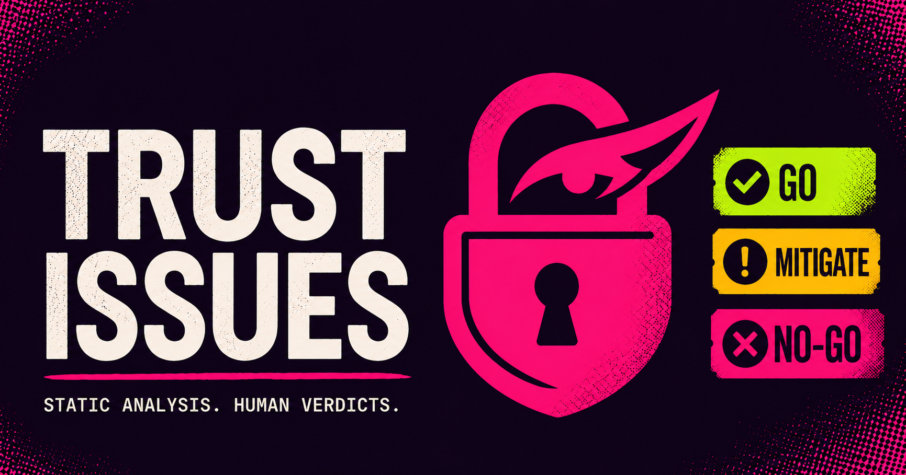
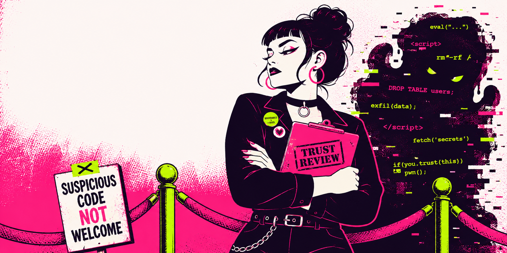

<p align="center">
  
</p>

<h1 align="center">Trust Issues</h1>

<p align="center">
  <b>An adversarial security review for any skill, repo, MCP server, or package you're about to trust.</b><br>
  It reviews code the way a suspicious security engineer would, then gives you a clear verdict: GO, GO WITH MITIGATIONS, or NO-GO.
</p>

<p align="center">
  
  
  
</p>

---

## Why use it

Installing an agent skill or an npm package runs someone else's code on your machine, often with access to your files and credentials. Public marketplaces have been seeded with malicious skills that lifted saved logins and wallet files the moment someone installed them. Trust Issues lets you check something before you run it instead of finding out afterward.

You point it at a repo, a skill, an MCP server, or a package, and it does an attacker-minded review and hands you a verdict with the findings behind it.

## How it works

The review has two layers. First, a read-only scanner does a fast pass over 13 categories of risk, from install hooks and obfuscated payloads to leaked secrets and hidden instructions. Then a five-persona adversarial read looks at what the scanner surfaced and reasons about intent, which is the part a keyword search can't do.

The scanner never runs the code it reviews. It reads files and reports what it sees.

## Why not just a signature scanner

Signature scanners exist, and they have a documented weakness. When researchers lightly disguised about 1,600 real malicious skills, most of them slipped past eight popular scanners. Pattern matching is straightforward to evade. Trust Issues relies on reasoning instead, treats prompt injection inside `SKILL.md` and MCP tool descriptions as a primary threat, and searches for current attack techniques at the start of every run so its knowledge stays current. It is also clear that a clean scan proves very little on its own, and that your real protection is a sandbox and least privilege.

## The benchmark

Most scanners quote an accuracy number without publishing the test set behind it. This one ships the test corpus so you can verify the number. Against 11 known-malicious fixtures and 8 benign ones, the scanner flags 10 of the 11. The sample it misses was built specifically to defeat pattern matching, and the miss is reported on purpose, because that case is what argues for the human read. Four of the benign fixtures also get surfaced for review, which is the expected cost of tuning the scanner for high recall.

Run it yourself with `bash benchmark/run_benchmark.sh`. Nothing in the fixtures folder is ever executed.

## The five personas

The manual read applies five lenses:

1. A **red teamer** hunting for backdoors, obfuscation, and credential theft.
2. An **architect and cryptographer** checking for OWASP mistakes and weak crypto.
3. A **supply-chain engineer** reading install hooks, CI workflows, and unfamiliar dependencies.
4. A **CISO** weighing where your data goes and whether the code asks for more access than it needs.
5. A **prompt-injection analyst** reading the skill's own words for hidden instructions.

That last lens is the one generic code review skips, and it's the most important for an agent skill.

<p align="center">
  
</p>

## Install

**Claude Code**
```bash
git clone https://github.com/howshannon/trust-issues
cp -R trust-issues ~/.claude/skills/
```

**Claude Desktop / Cowork / claude.ai** — open Settings → Capabilities (or Skills) and add or upload the skill. You can also zip the folder as `trust-issues.skill` and use the Save-skill button.

Then ask for it by name: *"review this before I install it: <url>."* It also triggers on its own when you go to clone, install, or connect something you didn't write.

## How to use it

**The main use: you found a skill or repo on GitHub and want to check it before installing.**
Inside Claude (Code, Desktop, or Cowork) with the skill installed:

1. Copy the repo's URL, for example `https://github.com/someone/cool-skill`.
2. Paste it to Claude and say: *"review this repo for malware before I install it: <url>"* (or just *"Trust Issues this: <url>"*).
3. Claude clones it read-only, runs the scanner and the five-persona review, and replies with a **GO / GO WITH MITIGATIONS / NO-GO** verdict and the findings behind it.
4. Install it only if the verdict is GO — or GO WITH MITIGATIONS once you've applied the mitigations it lists.

You never run the target's code during this. Reviewing is not installing.

**You found code somewhere else** (a gist, a downloaded zip, an npm or pip package). Same move:
point Claude at it with *"review this before I run it: <url or path>"*. For a zip, unzip it into a
throwaway folder first (not your projects directory), then give Claude that folder path.

**You just want the fast terminal scan, without Claude.** The scanner is a standalone, read-only script:

```bash
# 1. clone the target into a sandbox folder, NOT your working tree
git clone --depth 1 https://github.com/someone/cool-skill /tmp/review-target

# 2. run the scanner — it only reads files, it never executes them
bash scripts/triage_scan.sh /tmp/review-target
```

Read the flagged categories. A clean result means the fast pass found nothing obvious, not that the
code is safe — for a real decision, run the full review in Claude.

## One rule worth repeating

Reviewing code is not the same as running it. Clone into a sandbox, don't install or execute the target while you're reviewing it (install hooks run code during install), and don't give an agent access to the untrusted code and your secrets at the same time.

## What's in here

```
trust-issues/
├── SKILL.md                 the workflow: acquire safely → research attacks → scan → 5-persona read → verdict
├── scripts/triage_scan.sh   read-only static triage, 13 categories
├── references/              threat catalog + report template
├── benchmark/               labeled fixtures + recall harness
├── ARCHITECTURE.md          how it's built and why
└── CONTRIBUTING.md          how to add new evasion patterns
```

## Prior art

See [PRIOR-ART.md](PRIOR-ART.md). Other tools cover similar ground and some are good. This one focuses on the agent-specific attack surface and tries to be clear about the limits of what a scan can tell you.

## License

MIT. Contributions of new evasion patterns are especially welcome.

## Disclaimer

This helps you review code. It does not guarantee that any code is safe, and it is not a substitute for a sandbox and sensible access limits. You are responsible for what you choose to run.
